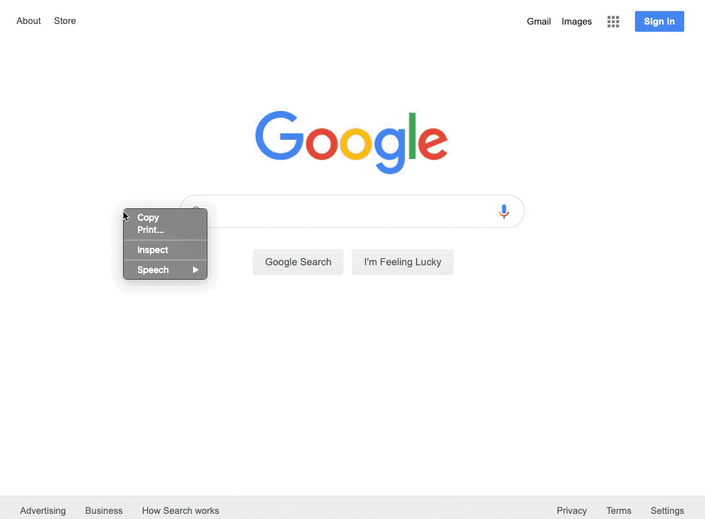
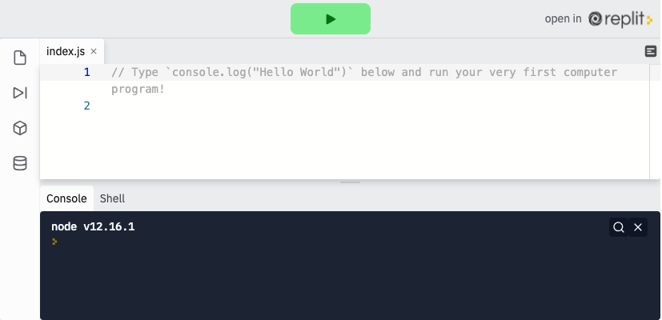
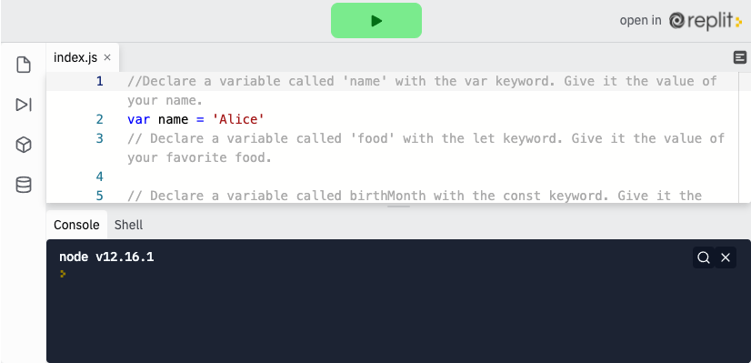

<div class="row">
<div class="columnStmt" markdown="1">

<p align="center"><a href="https://bloomtech-1.wistia.com/medias/234li2itp3" >
</a></p> 

##  What Javascript is and its use in web development   

[Home - Intro to JS](../README.md) 

[Home - Intro to JS](../README.md)  | [Next](./Object_2.md)

### **What is JavaScript and why do we use it?**

JavaScript is a programming language that was first created in 1994 as a way to add functionality and interactivity to a website. If we think back to our analogy of a web page as a house, we will remember that we said that JavaScript is the electricity, plumbing, and gas. It is what makes the web page "run". JavaScript was originally designed to be used purely on the front end as a way for web developers to add functionality to their web pages, and in its early days, it did just that. Recently, the introduction of the "V8 engine" by Google has improved the speed and functionality of JS. That led to the development and release of exciting new front end JavaScript frameworks and eventually Node.js, a way to run JavaScript on a server (back end). This new development has led to a resurgence of JavaScript. Now, JavaScript is one of the world's most widely-used programming languages. We can find JavaScript used on the front end, back end, mobile, Internet of Things (IoT), game development, and really anywhere a traditional programming language would be used. Though there are later versions, we will be focusing on and using JavaScript ES6 in this course because it is the most widely applicable.

####    **JavaScript vs Java (and other languages)**

Keep in mind, JavaScript is not the same as Java. Although they share similar names (this was, unfortunately, considered a good thing by JavaScript's early pioneers) that is where the similarities end.

The creators of JavaScript wanted to borrow concepts from other programming languages, such as Scheme, Java, and C. Those of you with backgrounds in other languages may see things that look very familiar, mainly the use of classes and Object-Oriented Programming (OOP) architecture. Keep in mind that JavaScript is not a "true" OOP language and many things you may be familiar with from another language won't work with JavaScript.

JavaScript is considered a 'loosely' typed language, in which types do exist, but they are not enforced. You do not have to declare a type when creating a variable or an array, for instance.

####    **How to 'run' JavaScript**

For this class, we are going to use a special code sandbox program just like we did with the last lesson (CodePen), called [repl.it](https://replit.com/). This will allow us to write and edit our code and run it right in our browser window to see a real-time read-out.

While this is one way to run your JavaScript, most JavaScript is run from a file with the extension of `.js` (e.g., `fileName.js`) and loaded into your browser via the `script` tag in your HTML.

JavaScript, being the de-facto language of the Internet, can also be run directly within an Internet browser. In fact, you can write all of the JavaScript you want and watch it run in real-time right in your browser by pressing F12 (for Windows), or Cmd+option+J (for Mac) (for Google Chrome). This will open up your console (we will learn more about the console later).

<p align="center" ></p> 

### **Hello World**

Hello World is traditionally used to introduce programmers to a new language. The origins of this date back to one of the first computer languages, C, where printing the phrase "hello world" was a major victory.

In JavaScript, printing "Hello, World!" requires just one line of code. Before you move on, try this example to write your first program!

<p align="center" ><a href="https://repl.it/@sunjieming/Hello-World?lite=true" >
</a></p> 

### **Variables**

At the heart of JavaScript are variables. A variable is a way to store, change and use data in code. To explain this concept, consider your favorite webpage: maybe it's instagram, maybe an online game. More than likely, there are lots of changing pieces on these pages - instagram has likes and usernames, a video game has character selection, game score, and many more - every one of those changing bits of data is stored in a variable. The variable called `score`, for example, starts with `0`, and changes every time you gather points in the game.

Similarly, you might create a variable called `greet` and store the value "Hello World" to further simplify your program above to `console.log(greet)`.

The syntax to create a variable is first the keyword, a space, the name we are giving the variable, an equal sign, the value we are assigning the variable, and then a semicolon. (A note for those with previous programming knowledge: JavaScript is a loosely-typed language, which means that a variable can be set, and reset, to any type. We do not need to declare its type when creating the variable.)

There are three keywords used to declare variables -`var`, `let`, and `const`. Each keyword comes with slightly different use cases, mostly based around what happens when you change the value of the variable. Some examples of syntax are below.

```
var firstName = 'John';
let lastName = 'Smith';
const favoriteFood = 'Taco';
```
####    **var**

`var` is the ES5 way of declaring a variable. This is a generic variable keyword. Variables created with var can be changed without causing errors. While that sounds like a good thing at first, using `var` too often might lead to buggy code.

Note in the example below that once you declare the variable, you can change it without having to declare again. This is true with all variable keywords.

```
var firstName = 'Alice';
firstName = 'Bob';        // <- this would be fine
```
If `var` is commonly regarded as bad programming practice, what should we use?

####    **const**

A const variable is a variable that cannot be changed later in the code. It's short for "constant". In our example above "Bob" could not be changed to "Alice" and would throw an error.
```
const firstName = 'Alice'
firstName = 'Bob'         // <- this would cause an error
```
This fixes the bug issue, but we know that sometimes variables do need to change - like, the score of a game. Is there a better solution?

####    **let**

Enter `let`. `let` is a new ES6 variable keyword. This will assign a variable much like `var`, but with a little bit different behavior. Most notably, it differs by creating "block level scope". For our purposes at the moment, `let` and `var` function almost exactly the same. When we get to writing functions and loops, we can start to use `let` to our advantage.

```
let firstName = 'Alice';
firstName = 'Bob';
```

To recap:

-   var can be re-assigned and changed.
-   let can be re-assigned but not changed.
-   const cannot be re-assigned nor changed.

Because these three keywords achieve the same thing (storing data in memory and assigning that data a 'key' that can be used for access) but behave very differently, there are places in this world for all three. And of course, as with everything, there are some other intricacies to learn about the `let` `const` and `var` keywords that we didn't cover here today.

**Lambda School Rule of Thumb** When defining/declaring variables use const until you can't, then use let.

We **highly** recommend researching the differences between `var`, `let` and `const` in terms of their scoping rules as well. We'll cover more on this later on when talking about function vs. block scoping. But for now, I'll point you towards the **Dig Deeper** section's link, **How let and const are scoped in JavaScript**, for some further understanding here.

###  **Primitive Data Types (String, Number, Boolean)**

Primitive data types, also known as basic data types are the simplest data types in JavaScript. They're sort of like primary colors in that all other data types (which we will learn about in later lessons) are made of these types.

####    **Strings**

Strings are blocks of text. They will always be defined with quotation marks around them, either single or double. Any text with quotes around it (even numbers) are strings.

```
const dog = 'fido';
const string = '2';
```
####    **Numbers**

Numbers are just that, numbers. Numbers do NOT have quotes around them. They can be negative as well. JavaScript does have a limitation on the size of a number (+/- 9007199254740991), but only very rarely will that limitation come up.

```
const answer = 42;
const negative = -13;
```

####    **Booleans**

Booleans are an important relic from the origins of computer science. It is a dichotomous concept that powers binary code, still the very core of computers. You may have seen binary code in the past (e.g., 0001 0110…). That is Boolean logic. The only booleans in JavaScript are `true` and `false`, traditionally written in lowercase letters. These variables are useful when you need to employ some kind of dichotomous (or "yes"/"no") logic in your code.

```
const iLoveJavascript = true;
const isThisaString = false;
```
Note that while Booleans look like strings, the lack of ' around the words indicates that the variable is a boolean and it will work differently under the hood.

####    **Undefined and Null**

There are a couple of JavaScript objects that don't really fit into any type. Those are the values `undefined` and `null`. You will get `undefined` when you are looking for a variable that does not have a value yet. `undefined` simply means what you are asking for does not exist.

```
console.log(unkownVar); // undefined
```

`null` is an object that we, the developers, set when we want to tell other developers that the item they are looking for exists, but there is no value associated with it. While `undefined` is set by the JavaScript language, `null` is set by the developer. If you ever receive `null`, it means that another developer has set that value to `null`.

```
let phoneNumber = '123-456-7890';
phoneNumber = null;

phoneNumber; // null
```

One last thing to note, neither `undefined` nor `null` are strings. They are written just as they are without quotes around them, like a Boolean.

## Follow Along

<p align="center" ><a href="https://repl.it/@sunjieming/Declare-Variables?lite=true" >
</a></p> 

Declare a variable called 'name' with the var keyword. Give it the value of your name. The code below will console.log your variables. Don't touch this code!

To declare a variable with var we first use the `var` keyword, followed by the `name` of our variable, name, and finally the value, `Alice`

```
var name = 'Alice';
```
Declare a variable called 'food' with the let keyword. Give it the value of your favorite food. Declaring a variable with let works similarly to `var`, all we need to do is change the keyword to `let`. Remember that this will allow for mutability, but will show a warning when you try to change the value.

```
let food = 'Pizza';
```

Declare a variable called birthMonth with the const keyword. Give it the value of your birth month (i.e. January or February). Const doesn't allow for mutability, and much like you can't change your birth month, you can't change the value of this variable declared with `const`.

```
const birthMonth = 'February';
```

## Challenge

It's time to check your knowledge with a [Variables Challenge](https://codepen.io/BloomTech/pen/zLydNr). There is a solution link at the bottom of the codepen to check your work.


</div>
</div>
