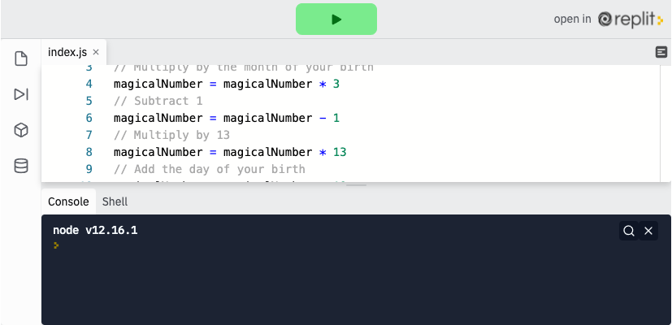

<div class="row">
<div class="columnStmt" markdown="1">

<p align="center" ><a href="https://bloomtech-1.wistia.com/medias/pnon34y10u" >
</a></p> 

##  Explain global object in Js and be able to use the Math object  

[Home - Intro to JS](../README.md) 

[Previous](./Object_1.md)  | [Next](./Object_3.md)


### **Math Operators**

Calculators were the first major computer function. In JavaScript, we have built-in math operators that work exactly as they do on your calculator.

####    **Standard Operators**

JavaScript can preform any standard operations - addition (`+`), subtraction (`-`), multiplication (`*`), and division (`/`) on integers and strings. There are dozens of practical applications of this, mathematical operations being just the beginning.

```
1 + 1; // returns 2
2 * 2; // returns 4
2 - 2; // returns 0
2 / 2; // returns 1

const num1 = 2
const num2 = 2

num1 + num2 // returns 4

const string1 = 'My name is'
const string2 = 'Bob'

string1 + string2 // returns 'My name is Bob'
```
####    **%**

Something you may not have seen before is the modulo operator (`%`). This math operator will divide two numbers (integers or floats) and return only the remainder. For example, `10 / 3` is 3 with a remainder of 1, so `10 % 3` (read as '10 mod 3') will return `1` .

```
21 % 5; // returns 1
21 % 6; // returns 3
21 % 7; // returns 0
```

####    **Math.pow**

We can use the `pow` method on `Math` to return a number raised to an exponent. It will take two numbers. The first is the base and the second is the power. For example, `Math.pow(5,2)` calculates 5 squared, which is 25. See some more examples below:

```
Math.pow(2,2) // returns 4
Math.pow(3,2) // returns 9
Math.pow(3,3) // returns 27
```
####    **Math.round, Math.floor, Math.ceil**

`Math` also has methods that will round numbers for us. `.round` will round a number to the nearest whole number. `.floor` will always round a number down to the nearest whole number. `.ceil` will always round up to the nearest whole number.

```
Math.round(6.5) // returns 7
Math.round(6.45) // returns 6
Math.floor(6.999) // returns 6
Math.ceil(6.0001) // returns 7
```

####    **Truthiness**

In these lessons, we have talked a lot about the Boolean values, `true` and `false`. When using an `if` statement or other statements that expect a Boolean value (such as the `!`, NOT), if the expression given is not a Boolean value, JavaScript will do something called type coercion and transform whatever it is given into a Boolean value. This is known as "truthy" and "falsey" - yes, seriously. Every data type has some truthiness to it. Here are some examples:

```
// items that are interpreted as true
true
1
' '
[] // an array, you'll learn more about this later
{} // an object, you'll learn more about this later
function() {}

// items that are interpreted as false
false
0
undefined
null
''
```

####    **Comparison Operators**

JavaScript has a number of comparison and logical operators, (`>` `>=` `<` `<=` `===` `!==`). These operators work just as they would in math: greater than, less than, greater than or equal to, and all the rest. We use these operators to evaluate two expressions. As the computer runs the code, the operator will return either a `true` (if the statement is true) or a `false` (if the statement is not true).

```
1 > 2;     // false
2 < 3;     // true
10 >= 10;  // true
100 <= 1;  // false
```
The "triple equals" sign ( `===` ) must not be confused with a single equal sign (which indicates assigning a value to a variable). The triple equal will compare everything about the two items, including type, and return if they are exactly equal or not.
(Something to note: there is also a "double equals" ( `==` ) sign which will compare two items, but it allows type coercion so a string and an integer can be considered equal (`1 == '1' // true`). Due to this, it is considered bad practice to use the double equal sign. We would like to see you always using the triple equal sign, and you will always see us using it.)

```
1 === 1;          // true
1 === '1';        // false
'cat' === 'cat';  // true
'cat' === 'Cat';  // false
```
The last comparison operator we would like to introduce you to has two parts to it.

First is the "NOT" (`!`). When you see this it will mean that we are asking the opposite of the expression (we will revisit the NOT operator later in this lesson).

With that in mind, we can introduce the "not equals" ( `!==` ) sign. This will return true if the items are NOT equal to each other, in any way. This, like the triple equal sign, takes type into account.

```
1 !== 1;          // false
1 !== '1';        // true
'cat' !== 'cat';  // false
'cat' !== 'Cat';  // true
```
####    **Logical Operators**

We can also combine two equality expressions and ask if either of them are true, both of them are true, or neither of them is true. To do this we will use Logical Operators.

####    **&&**

The first logical operator we will look at is the "AND" operator. It is written with two ampersands (&&). This will evaluate both expressions and will return true if BOTH expressions are true. If one (or both) of them is false, then this operator will return false.
For example, (`100 > 10 && 10 === 10`) will return true because both statements are true, but (`10 === 9 && 10 > 9`) will return false because one statement is false.

####    **||**

Next up is the "OR" operator. It is written with two vertical bars (||). This operator will check two expressions and return true if either one is true. It will return false only if BOTH expressions are false. As you'd expect a line where both parts are true would return true. Like so:

```
(100 > 10 || 10 === 10) //true
```

Similarly this line where only one expression is accurate, would return true. Like this:

```
(10 === 9 || 10 > 9) //true
```
If both expressions are false, like this, then the result will be false.

```
(10 === 9 || 1 > 9) //false
```

####    **!**

The last logical operator is the "NOT" operator. It is written as a single exclamation mark (`!`). We saw this operator earlier when determining equality (`!==`). As before, the NOT operator will return the opposite Boolean value of what is passed to it.

In this first case, since the opposite of false is true, (`!false`) would return true.

```
(!false) // true
```

Similarly since 1 is equal to 1 and this statement is true, `!(1===1)` would return false thanks to the `!` operator.

```
(!(1 === 1)) // false
```

####    **Notes About Logical Operators**

A couple things to note about logical operators.

-   The expressions are evaluated in order, and the computer will skip any redundant expressions. In an && statement, if the first expression is false, the second expression will not be evaluated because BOTH expressions need to be true. Same for the || statement. If the first expression is true, the second will not be evaluated because there only needs to be one true statement to fulfill the requirements of the operator.

-   Use parentheses. As we saw in the second ! operator example, we used parentheses to evaluate what was inside of the parentheses FIRST, then applied the ! operator. We can wrap ANY expression in parentheses and it will be evaluated before evaluating the expression as a whole.

##  Follow Along

You may have tried the following riddle on your friend as a kid. Using our knowledge of variables and math we're going to create a console application to return a person's birthday starting with just the number `7`. The steps we need to take are as follows.

```
Enter the number 7
Multiply by the month of your birth
Subtract 1
Multiply by 13
Add the day of your birth
Add 3
Multiply by 11
Subtract the month of your birth
Subtract the day of your birth
Divide by 10
Add 11
Divide by 100
```
<p align="center" ><a href="https://repl.it/@sunjieming/Math?lite=true" >
</a></p> 

We'll walk through the example for someone born on February 22. First, we need to create our magical number variable. We'll use let so that this can be easily changed.

```
let magicalNumber = 7;
```
Now, we test the riddle. For every calculation we will need to change the value of `magicalNumber` and preform the riddle step.

```
// Multiply by the month of your birth
magicalNumber = magicalNumber * 2
// Subtract 1
magicalNumber = magicalNumber - 1
// Multiply by 13
magicalNumber = magicalNumber * 13
// Add the day of your birth
magicalNumber = magicalNumber + 22
// Add 3
magicalNumber = magicalNumber + 3
// Multiply by 11
magicalNumber = magicalNumber * 11
// Subtract the month of your birth
magicalNumber = magicalNumber - 2
// Subtract the day of your birth
magicalNumber = magicalNumber - 22
// Divide by 10
magicalNumber = magicalNumber / 10
// Add 11
magicalNumber = magicalNumber + 11
// Divide by 100
magicalNumber = magicalNumber / 100
```

Finally, let's `console.log` our magical number and see if it returns `2.22` as expected. If our calculations are correct, this should work for any birthday!

```
console.log(magicalNumber)
```

To make this application more useful, you could create a variable called `birthMonth` and another called `birthYear` and let the program run on its on.

##  Challenge

Check your knowledge with a short [math challenge](https://codepen.io/BloomTech/pen/xxbvoLx)


</div>
</div>
