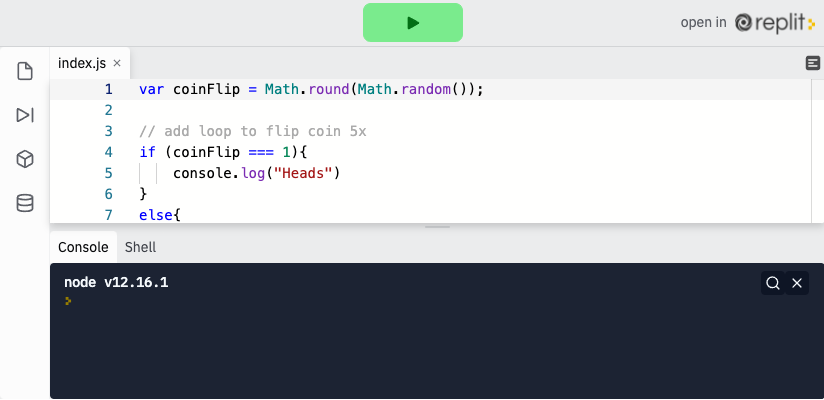

<div class="row">
<div class="columnStmt" markdown="1">

<p align="center" ><a href="https://bloomtech-1.wistia.com/medias/2jott8ytl0" >
</a></p> 

##  Perform git controls in command line

[Home - Intro to JS](../README.md) 

[Previous](./Object_2.md)  | [Next](./Object_4.md)

### **Control Flow**

Often times, as a computer is reading and executing our code, we want code to run only if something is true or not. For example, add one point to the variable `score` if the character touches a coin. This is known as control flow or conditional logic. Control flow means that not all code on the screen is executed in order, or at all. We will learn to use some basic control flow today, and will dive deeper into it in our next lesson.

Let's say you wanted to write a simple script to check whether someone is a legal driver. You could use conditional logic to print a `true` or `false` boolean.

<p align="center" ><a href="https://repl.it/@sunjieming/Conditionals?lite=true" >
</a></p> 

Here we are taking a number (age) and checking to see if the statement is true. The statement 16 > 15 is true, so our code will return `true`. If it is not, it will skip that chunk of code and return `false`.

**Check For Understanding:** Change the value of `age` above so that the code will return `false`.

We just learned about the `if` operator. We can use `if` to check and see **if** an expression is true. If it is, JavaScript will run some code. If it is not, JavaScript will skip the code and keep running the program.

```
if (1 + 1 === 2) {
    console.log('The expression is true!');
}
// since 1 + 1 does equal 2, JavaScript will console.log ("The expression is true!")

if (1 + 1 === 3) {
    console.log('The expression is true!');
}

// since 1 + 1 does NOT equal 2, JavaScript will NOT console.log ("The expression is true!")
```

To add on to `if`, we can also use the `else` and `else if` statements. These statements must be used only after `if` has been used. These statements will be evaluated `if` the initial `if` returns false. We can think of the `else if` as another `if` statement that has been chained (we can have as many `else if` statements we want). Only one `if` or `else if` statement code block will be run. `If` at any time a statement evaluates to true, that code will be run and the rest will be skipped:

```
if (1 + 1 === 3) {
    console.log('This will be skipped!'); // since 1 + 1 is NOT 3, this will be skipped
} else if (1 + 1 === 2) {
    console.log('This code will be run.'); // since 1 + 1 is equal to 2, this will be run
} else if (1 - 1 === 0) {
    // 1 - 1 IS 0, however, the previous if statement was already true, so this will be skipped
    console.log('This code will NOT be run.');
}
```

The else statement will always come at the end of an if-else if chain, and will act as a default. If none of the expressions returned true, the else code block will be run no matter what. If any of the previous if or else if expressions are true, the else statement code block will not be run.

```
if (1 + 1 === 3) {
    console.log('This will be skipped!'); // since 1 + 1 is NOT 3, this will be skipped
} else if (1 + 1 === 3) {
    console.log('This code will NOT be run'); // since 1 + 1 is NOT 3, this will be skipped
} else {
    console.log('This code will be run'); // since the above were skipped, this will run
}
```

####    **Why use else-if?**

You may be thinking to yourself, "Why not just use a bunch of different if statements? Why use else-if? That is a valid question, and sometimes that is the right approach to take. It is up to you to decide which is the right approach. Remember, when using a block of conditionals, only ONE of the statements will be run, even if there are multiple statements that are true. The same can not be said for multiple if statements; they will run if true regardless of statements before and after. Take this example:

```
const age = 21;
if(age > 20) {
    console.log('older than 20!');
} else if (age > 15){
    console.log('older than 15!');
} else {
    console.log('younger than 15!');
}
```

In the above example only `older than 20`! will be logged even though both the if statement and else if statement were true.

```
const age = 21;
if(age > 20) {
    console.log('older than 20!');
}
if (age > 15) {
    console.log('older than 15!');
}
if (age <= 15) {
    console.log('younger than 15!');
}
```

In the above example the first and second if statements would be logged because both of them are true.

As you can see, it will be up to you to decide if you want to have multiple actions based on your data or just one action.

## Follow Along

**Note**: the following example will span several lessons, we suggest forking the repl.it below and saving your work as you go along. As always, you can also code along in the repl.it here.

[Show me Repl](https://repl.it/@sunjieming/coinFlip-I?lite=true)

<p align="center" ><a href="https://repl.it/@sunjieming/coinFlip-I?lite=true" >
</a></p> 

Let's create an algorithm to flip a coin and `console.log()` "heads" or "tails." To do this, we'll generate a random `0` or `1` and write a conditional if statement to return the `heads` or `tails` reading.

First lets set up a variable called `coinFlip` and give it a randomly assigned `0` or `1` value. To do this we need to use two methods of the `Math` object - `Math.round()` and `Math.random()`. `Math.random()` generates a random number between 0 and 1, and `Math.round()` rounds that decimal to the nearest whole number.

In the syntax below, Javascript first reads `Math.random()` and generates a random number, for example, 0.56324. Then it reads `Math.round()` and applies it to the random number, giving an integer, in this example, a 1.

```
var coinFlip = Math.round(Math.random());
```
Add this to your repl.it and console.log() `coinFlip` a few times to make sure you're getting a mix of `0`s and `1`s.

Next up, we'll add our conditional logic. Since we already have a randomly generated 0 or 1, we can set up an if/else statement where `1` represents `"Heads"` and `0` represents `"Tails"`.

We'll write this statement using the syntax we learned above, such that if `coinFlip` is equal to 1, we will console.log `"Heads"`. Otherwise (else), we can assume `coinFlip` must be 0 and console.log `"Tails"`.

```
if (coinFlip === 1){
    console.log("Heads")
} else{
    console.log("Tails")
}
```
We now have a fully functional coin flipping algorithm! Congratulations. You can view and run the solution code in the pen below. We'll continue to add to this over the next few objectives.

[Show me Repl](https://repl.it/@sunjieming/coinFlip-II?lite=true)

<p align="center" ><a href="https://repl.it/@sunjieming/coinFlip-II?lite=true" >
</a></p> 

## Challenge

Check your knowledge with the [conditionals challenge](https://codepen.io/BloomTech/pen/bGNXPxK?editors=0010).


</div>
</div>


