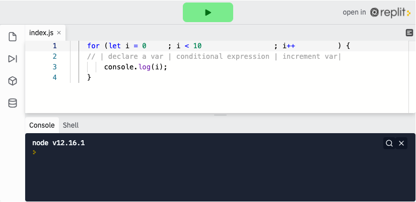
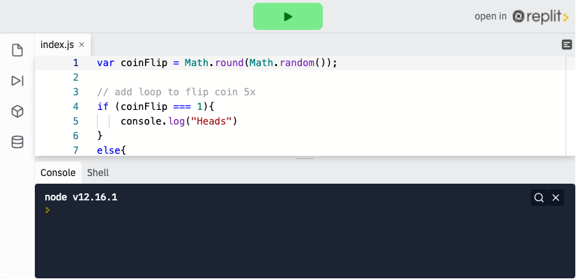
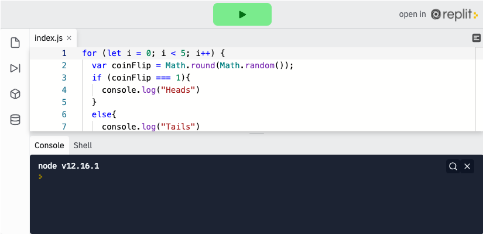

<div class="row">
<div class="columnStmt" markdown="1">

<p align="center" ><a href="https://bloomtech-1.wistia.com/medias/sp9lbgrv1o" >
</a></p> 

##  Write a basic for loop and while loop

[Home - Intro to JS](../README.md) 

[Previous](./Object_3.md)  | [Next](./Object_5.md)

### Loops

Most software runs on loops, evaluating expressions over and over again until it either returns what we are looking for, or hits a certain number of loops. JavaScript has two looping expressions built into it and today we will look at the first one, the "for" loop.

### For Loops

Imagine you wanted to console.log() the phrase `hello, world!` 5 times. With your current knowledge that would look something like this. This is just for illustration, please, never code like this.

```
console.log("hello, world!");
console.log("hello, world!");
console.log("hello, world!");
console.log("hello, world!");
console.log("hello, world!");
```

In general, you should almost **never** have to copy and paste chunks of code. Not only is it a bad programming practice, it is time consuming, and it leads to errors. Consider, for example, how much work it would be if you wanted to change "world" to someone's name. So how would you console.log() `hello, world!` five times? Using `for` loops! With a `for` loop, the above example could be reduced to the following.

```
for (let i = 0; i < 5; i++) {
// | declare a var | conditional expression | increment var|
    console.log("hello, world!");
}
```

`for` loops are useful anytime you need to run the same block of code a certain number of times. Imagine you go to the store and want to buy 10 avocados. Instead of scanning each avocado one by one, the cashier will add the cost of one avocado to your total **for** each avocado you buy. In other words, **for** each avocado, add `cost`. This would result in adding `cost` 10 times.

`for` loops have a unique syntax, similar to the `if` statement, but slightly more complex. First, we have the `for` keyword, followed by parentheses, and then open and close braces. Within the parentheses, we will need three things. First, we must declare a variable (usually `i`) as a starting point. Then, we will have a conditional expression. The loop will continue happening until this statement is `false`. Third, we will increment our variable, telling the loop a pattern to follow. Usually, the increment will be `i++`, meaning increase `i` by 1 every time the loop runs. All three of these statements are separated by a semicolon.

```
for (let i = 0      ; i < 10                 ; i++          ) {
//  | declare a var | conditional expression | increment var|
     console.log(i);
}
```
In this example, we see that we initially set our `counter` variable (`i`) to 0. The loop will run and each time it gets to the end, it will increase the counter by one. The for loop will then evaluate the conditional expression. If it is `true`, it will run again, but if it is `false` it will stop running. Therefore, the return of the example above would be the following:

<p align="center" ><a href="https://repl.it/@sunjieming/For-Loops?lite=true" >
</a></p> 

**Check For Understanding**: Edit the code above to return 1,2,3,4,5,6,7,8,9,10 (each on a new line is fine).

### **The ++ operator**

We saw in the last two examples the `++` operator. This is JavaScript shorthand for "Set the value of the variable to its current value plus one". There are a few more of these variable math/assignment shorthand expressions. We will visit them in upcoming lessons.

### **While loops**

While loops are similar to for loops in that they make it easy to repeat some action for a desired amount of time. Just like for loops, they will run so long as a condition is met. The key difference here is that you don't need to declare an incrementing variable when you declare a while loop.

Syntactically, while loops look like this. Note that the example below is what we call an "infinite loop" because the condition will never be false.

```
while (i === true) {
  console.log("i is true");
}
```

Most practical example of loops will use some kind of "counter", an outside variable that will be affected by what's inside the loop. A more practical example of a while loop, using a counter, might look like:

```
let count = 1;
while (count < 10) {
    console.log(count);
    count +=2;
}
```
The return of this loop would be 11 because the loop would add 2 every time it runs, until the value is greater than 10.

### **Infinite Loops**

As mentioned, it is possible to write a loop such that it never ends. This is what we call an "Infinite Loop" and it will break your program. Take for example this loop:

```
for (let i = 0; i >= 0; i++) {
    console.log(i);
}
```
Because our conditional expression will ALWAYS be `true` (`i` will never be less than 0) this loop will essentially run forever. This will break your program, and may crash your web browser, or computer.

##  Follow Along

Let's wrap our heads/tails program in a loop to allow a user to play more than one time.

We'll start where we left off with the conditional. Its actually fairly simple to add loop functionality. We're going to wrap this whole chunk of code inside a for loop.

<p align="center" ><a href="https://repl.it/@sunjieming/coinFlip-II?lite=true" >
</a></p> 

To do so we'll utilize the same syntax from above, and for now we'll tell the loop to run five times. We'll start by declaring the `for` keyword, then setting our initial value to `0` (`let i = 0`). We want the loop to run until `i` is equal to `5`, `i < 5`, and to add `1` to `i` every time the loop runs.

```
for (let i = 0;         i < 5;          i++) {
//   start at 0   | loop until 5   | add one every time
```

As you might imagine, we can now change the number of coinFlips to preform by changing the conditional expression above, so `i < 5` could change to `i < 10` and our coin would be flipped 10 times.

Its important to note that the variable needs to go inside of the loop so that it is randomly generated each time the loop runs. Otherwise, `coinFlip` would be declared outside of the loop and our end result would be 5 `heads` or 5 `tails`. Go ahead and try moving the variable around to see what we mean.

With this seemingly simple MVP, you could go on to add a lot of functionality to this program, including user interaction through `window.prompt()` or by integrating HTML. Again, you can view and run the solution code in the pen below.

<p align="center" ><a href="https://repl.it/@sunjieming/coinFlip-III?lite=true" >
</a></p> 

## Challenge

Check your knowledge with a short [loops challenge](https://codepen.io/BloomTech/pen/BaNBBpN?editors=0012)


</div>
</div>


