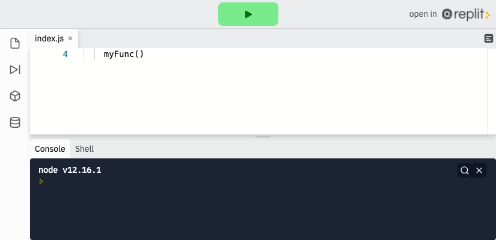
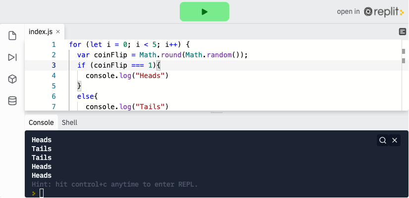
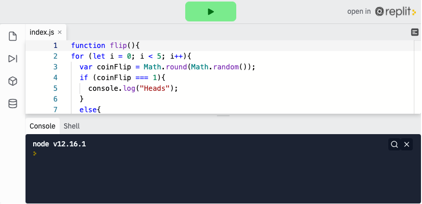

<div class="row">
<div class="columnStmt" markdown="1">

<p align="center" ><a href="https://bloomtech-1.wistia.com/medias/pjsxvz27r3" >
</a></p> 

##  JavaScript functions

[Home - Intro to JS](../README.md) 

[Previous](./Object_4.md)  | [Next](./Object_6.md)

### Introduction to Functions

Functions allow you, the developer, to repeat sections of code with just a single line. Consider, for a second, you want to "program" a robot to bake you cookies. A practical program, because you'd have cookies all the time! Code, without functions, might include steps like `addFlour`, `addEggs`, `addChocolateChips`, `preheatOven`, `bake`. A function could collect these steps into a container called `bakeCookies()`. Then, running `bakeCookies()` would produce the same, delicious result as the individual steps.

We mentioned earlier that you never want to copy and paste code, this is not only true when you want to repeat one single action, but also when you want to repeat a whole chunk of actions. In the case of the latter, we use functions.

We can think of functions as small computer programs. Functions allow us to write code that will be used over and over again, keeping our code `DRY` ("**D**on't **R**epeat **Y**ourself!").

Before we dive into syntax, study the following example and predict the output.

```
function myFunc() {
    console.log('this is my function!')
}
myFunc()
```

If you guessed that the output would be `this is my function`, congratulations - you are correct! Once you've declared a function, like myFunc it can be used over and over again to give the same, predictable result.

<p align="center" ><a href="https://repl.it/@sunjieming/Functions?lite=true" >
</a></p> 

**Check For Understanding**: Edit the code above to `console.log()` "Hello, World!" when `myFunc()` is called.

### **Function Syntax**

Just like we used `const`, `let`, and `var` to declare variables, we use the keyword `function` to declare functions.

```
function myFunc() {
// tasks go here
}
```
The `function` keyword tells whatever is running your program that what follows is a function and to treat it as such. After that comes the name - we like to give functions names that describe what they do, like `logsHello`. Then comes an open and a close parentheses, `()`. And finally, open and close brackets. In between these brackets is where all of our function code will go.

```
function logsHello() {
    console.log('hello');
}

logsHello();
```
In this example, we declare a function `logsHello` and set it up to `console.log` `'hello'`.

In order to run this function, we need to write or invoke its name with the parentheses after it, `logsHello()`. This is the syntax to run (aka. call) a function. A function always needs parentheses to run.

<p align="center" ><a href="https://repl.it/@sunjieming/Functions-2?lite=true" >
</a></p> 

**Check For Understanding**: The function syntax above is correct, but nothing shows up when the program is run! Add a line of code so that the console displays `hello`.

### **Function Declaration Hoisting**

JavaScript utilizes a two-pass compiler when executing lines of code that we write. This means that anytime we run JavaScript in the browser, the browser will take two passes over our code. The first pass builds up references to all of our code, declaring variables and functions and the like. The second pass applies values to the references that were found, thus actually running the code.

Function declarations are defined in the first pass. The compiler is made aware of the function declaration and adds it to the top of the execution order for your code. This concept of putting a function higher in the execution order for later use is known as hoisting.

What does this mean for you? It means that function declarations can be invoked before they are defined! Let's take a look at an example:

```
// This code is valid above the definition!
console.log(add(2,4)) // 6

function add(a,b){
 console.log(a + b);
}
```

This is odd behavior to developers new to JavaScript. It can be used as a feature or introduce bugs if not understood properly. Be aware that hoisting applies to function declarations and not function expressions or arrow functions.

### **Function Expressions**

Now that we have a better understanding of how basic function syntax works, we can push even further into another type of function, a function expression.

Function expressions have unique differences when compared against function declarations:

-   A variable is used to store the function for later use
-   Anonymous functions are used
-   Function expressions are not hoisted. They can only be invoked after a definition has been placed in the execution stack.

Example of a function expression:

```
const add = function(a,b){
 console.log(a + b);
}
add(2,4) // 6
```

Notice the function doesn't actually have a name. This is what we refer to as an anonymous function. Because we are using a `const` named `add` we don't need to name our function anything. We can simply execute the function when `add` is referenced by invocation.

Why do this and not use a function declaration? Because we have more control over our code now. We will discuss this in greater detail later on with scope and closure. For now, just know that arrow functions make code more concise.

### **Arrow Function Expressions**

Arrow functions are fancy looking function expressions with a major feature removed, the `function` keyword. We won't focus on why this is important right now, Instead, we will start getting used to seeing the syntax of what an arrow function looks like:

```
// function expression syntax
// const add = function(a,b) {
//  console.log a + b;
// }

// arrow function expression syntax
const add = (a,b) => {
 console.log(a + b);
}
add(2,4) // 6
```
You will notice that we removed the `function` keyword in front of our parameters and then added a `=>` token behind the parameters. This is a pretty straightforward conversion!

Syntactically, we didn't remove much, we lost a few characters in the word `function` and gained a `=>`. However, there are many sub-rules for syntax with arrow functions. Those sub-rules can create extremely streamlined syntax. This line of code is a good example.

```
// streamlined arrow syntax
const add = (a,b) => console.log(a + b);

add(2,4); // 6
```
Wow, there are a lot of abstractions occurring there! We do not need our `{}` because they are redundant in the rules of arrow functions. You haven't seen `return` statements yet, but they too, are not needed in arrow functions.

It's fun to see how slim we can get, but a word of caution: stick with the simple conversion first and slowly step into using other syntactical sugar approaches as you progress.

Often, developers will go too far with syntactical sugar, and the code becomes very hard to read. Arrow function expressions are great to use with array methods, for example, but may not be a great choice in a lot of other places.

### **When Not To Use Arrow Functions**

There is a time and place for arrow functions. Here is a list of times you should not be using them:

-   Event handlers (Unless they are inside a class constructor!)
-   Object methods
-   Prototype methods
-   Anytime you need to use arguments Object

## Follow Along

Let's return to our coin flip game to create a function `flip()` that will run our code with a single line.

<p align="center" ><a href="https://repl.it/@sunjieming/coinFlip-III?lite=true" >
</a></p> 

Just like with loops, all we need to do is add another layer of functionality here, so we'll wrap a function declaration around all the code we already have.

We need to declare the function with the keyword `function`, then name it with `name` + `()`, so here we can write `function name()` and wrap the whole function in curly brackets (`{}`) like so.

```
function flip() {
    // coin flip algorithm goes here
}
```
When this process is successfully completed, a single line of code (`flip()`) will run our coin flip game! As usual, view and run solution code below.

[Show me Repl](https://repl.it/@sunjieming/coinFlip-IV?lite=true)

<p align="center" ><a href="https://repl.it/@sunjieming/coinFlip-IV?lite=true" >
</a></p> 

## Challenge

Check your knowledge with the [functions challenge](https://codepen.io/BloomTech/pen/VwLwdQE?editors=0012).


</div>
</div>

