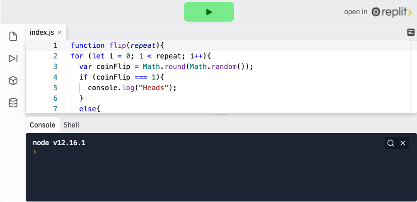

<div class="row">
<div class="columnStmt" markdown="1">

<p align="center" ><a href="https://bloomtech-1.wistia.com/medias/r1zpe7glrk" >
</a></p>

##  Functions - arguments, parameters, and return   

[Home - Intro to JS](../README.md) 

[Previous](./Object_5.md)  | [Next](./Project.md)

### **Passing Data into Functions**

Let's return to our cookie example. Pretend that you want your robot to bake different types of cookies. Do you need to write a new function for every cookie? Not at all. Instead, you could add a parameter, or variable, called `recipe` and call `bakeCookies('pecan')` or `bakeCookies('chocolateChunk')`.

Parameters are how functions accept changing data. Consider the example below.

```
function add(num1, num2) {
  return (num1 + num2);
}

add(2,2) // returns 4
add(4,5) // returns 9
```

We can declare variables called `parameters` (num1 and num2 in the example above) that represent data we will use when calling the function. This is similar to algebra. `X + Y = Z` would be a pretty meaningless equation, but once we substitute real numbers for `X` and `Y`, we can easily solve for `Z`. Here, `X `and `Y` are analogous to `parameters`, and the real numbers to `arguments`.

We'll dive into details about both parameters and arguments in this section, but the differences can be summarized as follows.

-   Function parameters are the names listed in the function's definition.
-   Function arguments are the real values passed to the function.
-   Parameters are initialized to the values of the arguments supplied.

####    **Parameters**

As illustrated above, a function parameter will represent the data we pass into a function, for use in the function. Essentially when we write a function we assign the data variable names, even without knowing what the data will be. We set these `variables` inside of the parentheses when we write the function. There is no limit to the amount of parameters we can include in a function, but each variable name must be separated by a comma. We can then use these `variables` within our function just as we would any other variable.

```
function myFunc( parameter1, parameter2) {
    // We can use parameter1 and parameter2 in this function just like a variable
}
```
####    **Arguments**

Once we have our parameters set up in our function, we can now pass data into the function. In order to do this, we will put each piece of data inside the the parentheses we write when we call the function. We call these pieces of data `arguments`. `arguments` can be ANY data type (string, number, Boolean, object, array, even other functions!). Unlike other languages, JavaScript does not require us to set the data type when we write the function, although you should make an effort to understand what type of data will be coming into the function (and if you are using pre-built functions, you should know what data type that function expects).

To use an argument, just put the data in the function call parentheses like so:

```
function logsName(name){
    console.log(name);
}

logsName('Dan'); // returns Dan
logsName('Diandra'); // returns Diandra
```

If you have more than one parameter, you will use more than one argument:

```
function logsSchool( School, descriptor ){
    console.log(`${School} ${descriptor}`);
}

logsSchool('Lambda', 'is Awesome!'); // logs Lambda is Awesome!
```
Arguments will always line up with parameters in order, so the first argument will be the first parameter, and so on.

If an argument is not given for a parameter, the parameter will be equal to `undefined`.

<p align="center" ><a href="https://repl.it/@sunjieming/Arguments-and-Parameters?lite=true" >
</a></p> 

**Check For Understanding**: Call logsPerson to return a greeting with your name, city, and favorite color without changing the function itself.

####    **The return Statement**

We will not always want to console.log() everything that comes out of a function. Most likely we will want to return something for use in other operations. The only way for us to use data that is local to a function is with the keyword return. return, essentially, lets data escape a function. Nothing other than what is returned can be accessed outside of the function. return is always the last thing in a function because when the function hits a return statement, the function immediately stops everything else that it is doing.

We can also assign the value of a return statement to another variable, and we will now have access to the data returned from the function.

```
function addTwoNumbers(num1, num2) {
   const sum = num1 + num2;
   return sum;
   console.log('This will never be reached');
}

const newSum = addTwoNumbers( 1, 2 );
console.log(addTwoNumbers(1,2)); //returns 3
console.log(sum); // returns undefined - sum exists only inside the function
console.log(newSum); // returns 3 - value is held in newSum
```
-   Note: We will never be able to have access to the actual variable created in the function. We will only have access to the data that variable was assigned to.

<p align="center" ><a href="https://repl.it/@sunjieming/Return-Statement?lite=true" >
</a></p> 

**Check For Understanding**: Declare a variable to save Alice's lottoTicket autoresponse and another to save Bob's lottoTicket autoresponse.

## Follow Along

When we left our coin flip game, it flipped the coin 5 times, according to the conditional expression in our `for` loop.

<p align="center" ><a href="https://repl.it/@sunjieming/coinFlip-IV?lite=true" >
</a></p> 

To allow our users to flip the coin a variable number of times we can use a parameter, repeat.

```
function flip(repeat){
    // add parameter
}
```
We will reference `repeat` into our conditional expression which will cause the loop to run a variable number of times.

```
function flip(repeat) {
  for (let i = 0; i < repeat; i++) {
      // use parameter as conditional expression
  }
}
```
When we run the function, we'll substitute the variable `repeat` for a number. For example, substituting repeat for 10, would flip the coin 10 times.

```
flip(10); // <- will flip coin 10 times
```
Our final product will look something like this. Play around with the `repeat` argument here until you can clearly explain how the argument changes the functions output.

[Show me Repl]()

<p align="center" ><a href="https://repl.it/@sunjieming/coinFlip-V?lite=true" >
</a></p> 

## Challenge

Check your knowledge with the [arguments and parameters challenge](https://codepen.io/BloomTech/pen/GRJRGxa?editors=0001).


</div>
</div>

