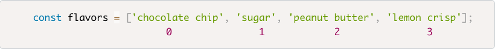
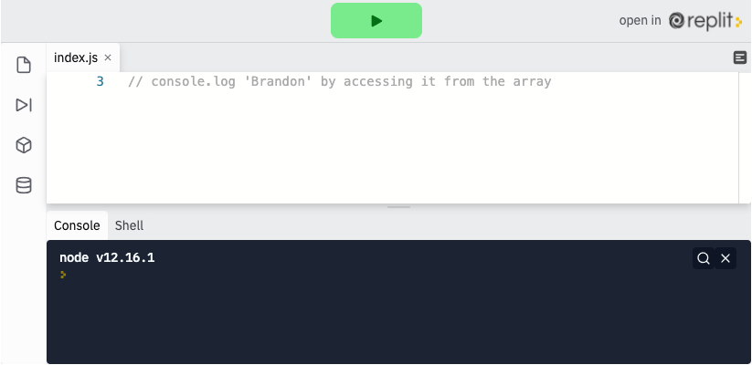
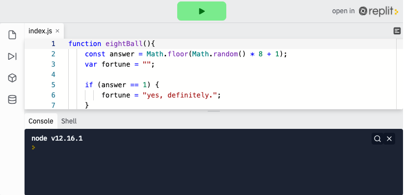

<div class="row">
<div class="columnStmt" markdown="1">

<p align="center" ><a href="https://bloomtech-1.wistia.com/medias/sbxel7vcf4" >
</a></p> 

##  Use arrays to store and access data   

[Home - Intro to JS](../README.md) 

[Home - Intro to JS](../README.md)  | [Next](./Object_2.md)

In the first JavaScript lesson, we discussed the 3 basic data types (strings, numbers, and Booleans), and how to assign those data types to variables. We discussed how a variable can only point to a single string, number, or Boolean. In many cases, though, we want to be able to point to a collection of data of either the same or different types. For example, what if we wanted to keep track of cookie flavors using a single variable, `flavors`. We can do that using Arrays. We can think of arrays as storage containers for collections of data. Building an array is simple: declare a variable and set it to []. We can then add however many strings, numbers, or Booleans we want to the container (comma separated), and access those items whenever we want.

```
const flavors = ['chocolate chip', 'sugar', 'peanut butter', 'lemon crisp'];
```

### **.length**

Just like the String data type which has a built-in `.length` property, the array also has a built-in `.length` property. In fact, the array has a lot of useful built-in methods (we will be discussing those in later lessons). Just as string `.length` counts the characters, array `.length` will return the number of items in an array:

```
    const flavors = ['chocolate chip', 'sugar', 'peanut butter', 'lemon crisp'];

    console.log(flavors.length);  // 4
```

### **Accessing Items in an Array**

We can access an item at any time in an array, we just need to call the item by its position in the array. Items are given a numerical position (index) according to where it is in the array, in order. An array's numerical order ALWAYS starts at 0, so the first item is in the 0 index, the second in the 1 index, the third in the 2, and so on (this can be tricky at first, but just remember **arrays always start at 0**).



In order to access the item, we will type the name or the array variable, followed by brackets containing the numerical assignment.

```
    const flavors = ['chocolate chip', 'sugar', 'peanut butter', 'lemon crisp'];

    console.log(flavors[1]);  // 'sugar'
```

<p align="center" ><a href="https://repl.it/@sunjieming/Indexing-Arrays?lite=true" >
</a></p> 

**Check For Understanding**: console.log 'Brandon' by accessing it from the array.

Without knowing an array's length, it's still possible to access the last item using some simple logic. The return of the length property `- 1` will always return the last item in the array. We know the first item is always going to be 0, and every item after is shifted over one number. So in our example, the last item has an index of 3 even though `flavors` has a length of 4. Therefore when we don't know the number of items in an array we can access the last item like so:

```
    const flavors = ['chocolate chip', 'sugar', 'peanut butter', 'lemon crisp'];

    console.log(flavors[flavors.length - 1]);  // 'lemon crisp'
```

### **Assignment**

We can assign and reassign any index in the array using the bracket/index and an `=`.

```
const flavors = ['chocolate chip', 'sugar', 'peanut butter', 'lemon crisp'];

    flavors[0] = 'caramel pecan';

    console.log(flavors);  // ['caramel pecan', 'sugar', 'peanut butter', 'lemon crisp']
```

## Follow Along

Study and run the following code. Here we have over 20 lines of code that, while functional, contain tons of repetition and can be reduced to 1, using an array. Our goal in this challenge will be to eliminate the need for conditionals using array indexing.

<p align="center" ><a href="https://repl.it/@sunjieming/EightBall-I?lite=true" >
</a></p> 

To begin, let's create an array called fortunes to hold all of the options.

```
const fortunes = ["yes, definitely", "you can rely on it.", "Without a doubt.", "most likely.", "hmm... I'm not sure!", "yikes. Nope.", "try again.", "very doubtful."]
```

We can access individual fortunes using their index like fortunes[0] or fortunes[1] to access "yes, definitely" and "you can rely on it," respectively.

Since we already have a random number generator built into our code in the form of `answer`. We can replace all of the conditionals with a single line, `console.log(fortune[answer]);`, condensing almost 20 lines into 1!

```
function eightBall() {
    const answer = Math.floor(Math.random() * 8);
    const fortunes = ["yes, definitely", "you can rely on it.", "Without a doubt.", "most likely.", "hmm... I'm not sure!", "yikes. Nope.", "try again.", "very doubtful."]
    fortune = fortunes[answer];
    console.log(fortune)
}
eightBall()
```
If we wanted to adjust our original code even further we could create a random number generator function. This code is easier to read and understand, but is similarly `DRY` compared to the above.

```
function getRandomInt(min, max) {
  min = Math.ceil(min);
  max = Math.floor(max);
  return Math.floor(Math.random() * (max - min)) + min; //The maximum is exclusive and the minimum is inclusive
}

function eightBall() {
    const fortunes = ["yes, definitely", "you can rely on it.", "Without a doubt.", "most likely.", "hmm... I'm not sure!", "yikes. Nope.", "try again.", "very doubtful."];
    var fortune = fortunes[getRandomInt(0,7)];
}
```

## Challenge

Check your skills with the [arrays challenge](https://codepen.io/BloomTech/pen/VwLwdVg?editors=0012)


</div>
</div>