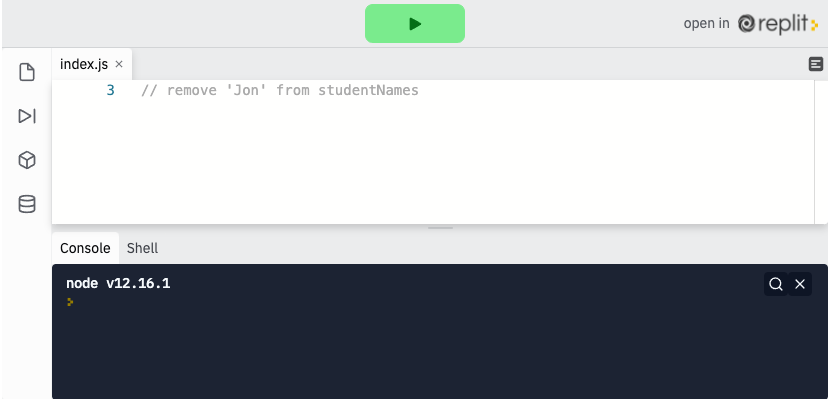
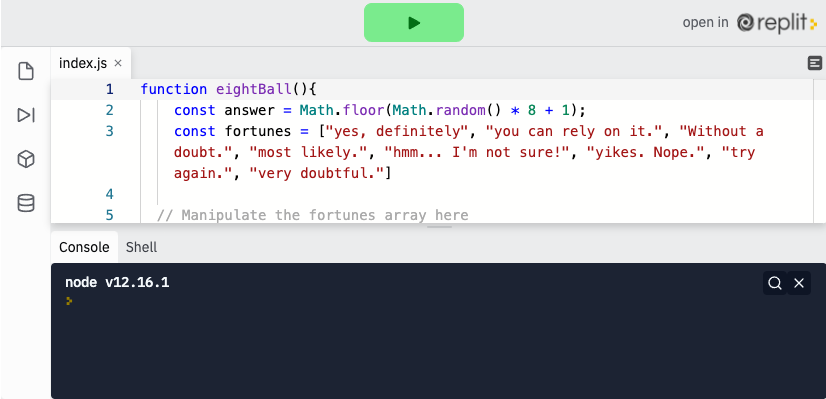

<div class="row">
<div class="columnStmt" markdown="1">

<p align="center" ><a href="https://bloomtech-1.wistia.com/medias/59j0f8g6b3" >
</a></p> 

##  Use array properties and array methods  

[Home - Intro to JS](../README.md) 

[Previous](./Object_1.md)  | [Next](./Project.md)

There will be times when you need to edit data inside of arrays, we have a few special `methods` in JavaScript to do so.

### **.length**

Just like the String data type has a built in .length property, so does the array. In fact the array has a lot of useful built in methods (we will be discussing those in a moment and in later lessons). Just like the string .length counts the characters, array .length will return the number of items in an array:

```
const flavors = ['chocolate chip', 'sugar', 'peanut butter', 'lemon crisp'];

console.log(flavors.length);  // 4
```

### **.push & .pop**

Two more very useful built-in array methods are `.push` and `.pop`. These methods refer to the adding and removing of items from the array after its initial declaration.

`.push` adds an item to the end of the array, incrementing its length by 1. (`.push` returns the new length)

```
    const flavors = ['chocolate chip', 'sugar', 'peanut butter', 'lemon crisp'];

    flavors.push('carmel Pecan');

    console.log(flavors);  // ['chocolate chip', 'sugar', 'peanut butter', 'lemon crisp', `carmel pecan`]
```

`.pop` removes the last item in the array, decrementing the length by 1. (`.pop` returns the "popped" item)

```
    const flavors = ['chocolate chip', 'sugar', 'peanut butter', 'lemon crisp'];

    flavors.pop();

    console.log(flavors);  // ['chocolate chip', 'sugar', 'peanut butter']
```

### **.unshift & .shift**

`.unshift` and `.shift` are exactly like `.push` and `.pop`, except they operate on the first item in the array. `.unshift(item)` will put a new item in the first position of the array, and `.shift()` will remove the first item in the array.

```
    const flavors = ['chocolate chip', 'sugar', 'peanut butter', 'lemon crisp'];

    flavors.unshift('carmel pecan');

    console.log(flavors);  // ['carmel pecan', 'chocolate chip', 'sugar', 'peanut butter', 'lemon crisp']

    flavors.shift();

    console.log(flavors);  // ['chocolate chip', 'sugar', 'peanut butter', 'lemon crisp']
```

<p align="center" ><a href="https://repl.it/@sunjieming/Array-Methods?lite=true" >
</a></p> 

**Check For Understanding**: Use an array method to remove 'Jon' from studentNames.

### **Notes on Arrays**

For those with prior programming experience: because JavaScript is not a strongly typed language, arrays do not need to be typed either. Arrays in JavaScript can contain multiple different data types in the same array.

## Follow Along

<p align="center" ><a href="https://repl.it/@sunjieming/EightBall-II?lite=true" >
</a></p> 

First, consider a scenario where we want to add another fortune. While we could edit our original array, it would be simpler and more mutable to do so using `.push()`.

```
fortunes.push("I wouldn't if I were you.")
```

Run this, then `console.log` the array to see your results.

Of course, after "pushing" that, we have 9 fortunes. We could easily remove that fortune using `.pop`.

```
fortunes.pop()
```

`Console.log` your array again.

In another scenario we might want to add that fortune to the front and remove the last one, 'very doubtful', from our list. We could combine the methods `.unshift` and `.pop` to accomplish this.

```
fortunes.unshift("I wouldn't if I were you.") // <- move to front
fortunes.pop() // <- delete last item
```

This example might feel somewhat silly, but hopefully you can start to see how these methods might be helpful in a larger codebase where editing the original array is unfeasible or impossible.

## Challenge

Check your knowledge with the [array methods challenge](https://codepen.io/BloomTech/pen/YJEdRQ?editors=0012)


</div>
</div>