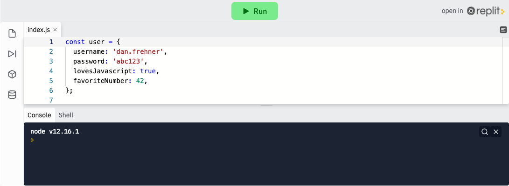
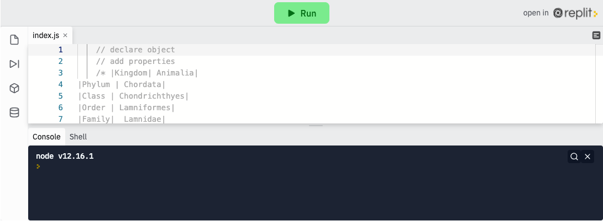

<div class="row">
<div class="columnStmt" markdown="1">

<p align="center" ><a href="https://bloomtech-1.wistia.com/medias/foj6wqpm3f" >
</a></p> 

##  Use objects to store and access data  

[Home - Intro to JS](../README.md) 

[Home - Intro to JS](../README.md)  | [Next](./Object_2.md)

### **Introduction to Objects**

In the last lesson, we introduced Arrays. Arrays are containers that hold collections of data. In this lesson, we will introduce another data container, the Object. Objects and arrays are similar in some ways and very different in others. Where arrays hold multiple items related to each other, Objects will hold a lot of information about one thing. Objects are instantiated (created) by using braces (`{}`).

```
    const newObj = {};
```

### **Key:Value pairs**

Objects use a concept called key:value pairs to house data (unlike arrays, which have index valued items). The key is the identifier and the value is the value we want to save to that key. The syntax is "key: value". Objects can hold many key:value pairs. They must be separated by a comma (no semi-colons inside of an object!). Keys are unique in an object. There can be only one key of that name. Although, multiple keys can have the same value. Values can be any JavaScript type, string, number, Boolean, array, function or even another object. In this demo, we will create a user object.

```
    const user = {
        username: 'dan.frehner',
        password: 'abc123',
        lovesJavascript: true,
        favoriteNumber: 42,
    };
```

### **Accessing Values**

Once we have key:value pairs, we can access those values by calling the object name and the key. There are two different ways to do this, dot notation and bracket notation.

With dot notation, we call the object name, a dot, and the key name, similar to the `.length` property on an array (hint: the length property is a key:value pair!):

```
    user.lovesJavascript; // true
    user.username;        // dan.frehner
```

Bracket notation is just like calling an item on an array, although with brackets we MUST use a string or number, or variable pointing to a string or number. Each key can be called by wrapping it with quotes:

```
    const passString = 'password'; //save key string to global variable
    user['lovesJavascript']; // true
    user['username'];        // dan.frehner
    user[passString];        // abc123
```

<p align="center" ><a href="https://repl.it/@sunjieming/Objects?lite=true" >
</a></p> 

**Check For Understanding**: What would happen if we removed the line const `passString = 'password';`? Test your theory above.

In the wild, you will see brackets almost always being used with variables.

### **Assigning Values**

We can assign values when we create the object, or later on with dot or bracket notation. Other than syntax, assigning values works just like assigning variables.

```
    const newUser = {
        isNew: true,
    }

    const loveJSString = 'lovesJavascript';

    newUser.username = 'new.username';
    newUser['password'] = '12345';
    newUser[loveJSString] = true;
```

### **Removing Properties**

If we want to remove a property, we can do it using the `delete` keyword:

```
    const newObject = {
        removeThisProperty: true,
    };

    delete newObject.removeThisProperty;
```

It is rare we will see the use of the `delete` keyword. Many consider it as best practice to set the value of a keyword to `undefined`. It will be up to you when the time comes.

## Follow Along

Let's look at an application of objects in a different context, biology. A little background knowledge, if you don't remember high school biology (we don't blame you) - every known organism on earth is classified using the Linnaean taxonomy system: a kingdom, phylum, class, order, family, genus, and species.

Our challenge today will be to create an object containing all of the classification data for a great white shark. Consider the keys and values below.

| Classification    |  Name      |
| ----------------- | ---------- |
| Kingdom	        |   Animalia |
| Phylum	        |  Chordata  |
| Class	            | Chondrichthyes |
|   Order	        |   Lamniformes |
|   Family          |	Lamnidae |
|   Genus	        | Charcharodon |
|   Species         | Charcharias |

We need to create an object called `greatWhiteShark` and add everything in the classification column as a key, with everything in the name column as a value.

Syntactically, we'll declare a new object with `const greatWhiteShark`, then add keys and values with the syntax we learned above - `key: value`,. For the first key:value paid, that will look like `kingdom: 'Animalia',`.

Note: Since JavaScript identifies `class` and `order` as keywords, we'll need to name our properties differently. For consistency, we'll use the prefix my - creating `myKingdom`, `myPhylum`, and the like.

Declare `greatWhiteShark` below and add classification data.

<p align="center" ><a href="https://repl.it/@sunjieming/Animal-Kingdom-I?lite=true" >
</a></p> 

```
const greatWhiteShark = {
    myKingdom: 'Animalia',
    myPhylum: 'Chordata',
    myClass: 'Chondrichthyes',
    myOrder: 'Lamniformes',
    myFamily: 'Lamnidae',
    myGenus: 'Charcharodon',
    mySpecies: 'Charcharias',
}
```

Now, we can access any data using dot notation. For example, we can use the object, `greatWhiteShark`, followed by a . and the property of interest, for example, `myKingdom`, to access the value, `Animalia`.

```
greatWhiteShark.myKingdom // returns Animalia
```

If we wanted to add to our `greatWhiteShark` object, we can do so using dot notation. Let's add the conservation status for the great white shark.

Let's add the conservation status for the great white shark.

```
greatWhiteShark.conservationStatus = 'vulnerable'; // Adds new property
```

Species are traditionally lowercase, let's edit that property to reflect taxonomically correct properties.

```
greatWhiteShark.mySpecies = 'charcharias'; // edits property value
```

Get comfortable adding, reassigning, and removing properties and values before moving onto the challenge.

## Challenge

Work through all of these exercises on [codepen](https://codepen.io/BloomTech/pen/gBXdEe)


</div>
</div>