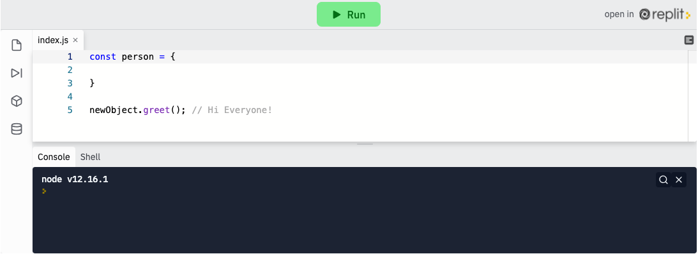
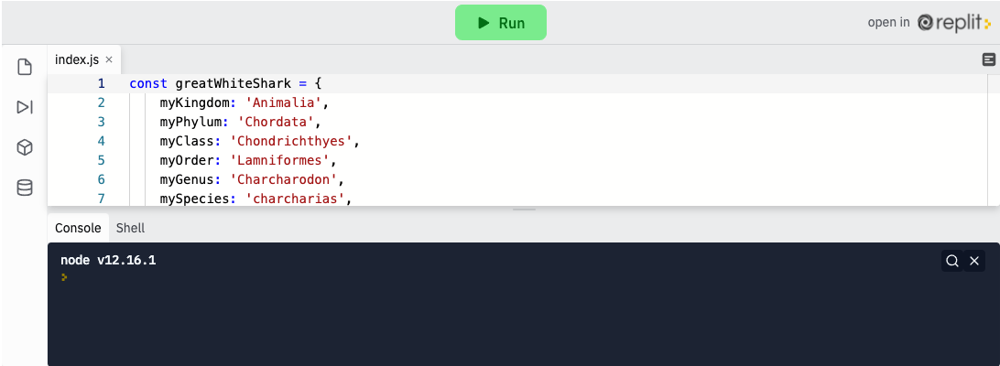

<div class="row">
<div class="columnStmt" markdown="1">

<p align="center" ><a href="https://bloomtech-1.wistia.com/medias/poy1w6weya" >
</a></p> 

##  Learn to create methods on Objects, and utilize the ‘this’ keyword   

[Home - Intro to JS](../README.md) 

[Home - Intro to JS](./Object_1.md)  | [Next](./Project.md)

### **Properties and Methods**

Think of a method as a function that is the value in an object's key:value pair. For example, when calling Math.pow(2, 2) we are actually referencing a function that is assigned to the key pow on that Math object. Similarly, pow(2,2) would throw a ReferenceError unless there was a function in scope named pow.

Primitive data types (and other data types) have built-in method functionality as well. These extend the functionality of the primitive data types and allow us to gather information about them, or manipulate them in some way. .pop, for example, is a method that acts on the array data type. Both properties and methods will be accessed using the dot notation where we give the name of the variable, a dot, then the name of the property or method.

```
objectName.methodName();
```

**Properties**

Properties allow us to access data from a data type. There are many different properties on every data type that will give you a bit of information about that specific object.

One we will look at here is the `length` property of a `string`. It will give us the length of the string, as in how many characters are in the string (spaces count).

```
  const school = 'Lambda';
  school.length; //6
```

**Methods**

Methods allow us to manipulate a data type. Methods are different from properties in that they need to have parentheses on the end. Its important to note that methods are just functions and in order to invoke a function you use parentheses. The parentheses don't make it a method, in other words.

The method we will look at here is the `toString` method. It will convert a Number or Boolean to a string.

```
  const num = 42;
  num.toString(); //"42"
```

### **Global objects and methods**

JavaScript has a number of built-in objects for us to use. These `global` objects extend the functionality of the language for us for free. We have already seen, and have been using, the console object and its method `log`. Another one of these objects is `Math`. `Math` has a number of methods on it just like `console` has `log`. To add to this, some of our data types also have built-in methods.

There's no purpose in trying to memorize all of the properties and methods associated with primitive or built in data types. Instead, focus on understanding how they work and getting comfortable with their unique use cases.

**Methods**

In addition to built in methods, we can create methods inside objects. We have used plenty of methods so far throughout this course. We can set a key to a name, and the value to a function. Just like other times we call methods, we will call this method using dot notation and trailing parentheses. `.length`, `.push`, `.pop`, etc., are all methods created this way. (note: we can call a method with arguments just as we would a normal function):

```
    const newObject = {
        sayHiMethod: function() {
            console.log('Hi Everyone!');
        },
    }

    newObject.sayHiMethod(); // Hi Everyone!
```

<p align="center" ><a href="https://repl.it/@sunjieming/Method-Properties?lite=true" >
</a></p>

Check For Understanding: Create a method on the person object that returns a greeting

### **for…in Loops**

Sometimes we want to iterate over each key:value pair in our object. With arrays, we used a standard for loop and an index number variable. Objects do not contain numerical indexes so the standard loop will not work for objects. JavaScript has a second type of for loop built in called the "for…in" loop.

The syntax of the "for…in" loop is slightly different from our first for loop, and thankfully, a bit more intuitive. After the `for` keyword, in parentheses, we will declare a variable (`let variableName`), use the keyword `in`, and then state the name of the object. This will loop over each key in the object and finish when all of the keys have been iterated over. We can use this key, and bracket notation, in our for loop to access the value associated with that key.

```
    const user = {
        username: 'dan.frehner',
        password: 'abc123',
        lovesJavascript: true,
        favoriteNumber: 42,
    };

    for (let key in user){
        console.log(key);
        console.log(user[key]);
    }

    // username
    // 'dan.frehner'
    // password
    // 'abc123'
    // lovesJavascript
    // true
    // favoriteNumber
    // 42
```

### **The 'this' Keyword**

Objects have a self-referential keyword that may be applied in each object called `this`. When called inside of an object it is referring to that very object. `this` can be used to access other keys in the same object, and is especially useful in methods:

```
    const user = {
        username: 'dan.frehner',
        password: 'abc123',
        lovesJavascript: true,
        favoriteNumber: 42,
        userSaysHi: function(){
            console.log( this.username + ' says hi!');
        },
    };

    user.usersaysHi(); // 'dan.frehner says hi!'
```

Note: the `this` keyword can sometimes be one of the more difficult topics in JavaScript. We are using it very basically here, but the topic gets much more complex very soon. We'll dig into that later on.

**Check For Understanding**: Return to the repl.it above and add your name into the greeting you created.

### **Objects in JavaScript**

In this lesson, we learned what Objects are and the many ways to access values, call methods, and assign values. Many of these techniques looked very familiar, as if we had used them in virtually every aspect of our learnings so far. There is a pattern here, that is because just about everything in JavaScript is an Object. Arrays are just objects with numerical keys, Strings are objects under the hood with built in methods, functions are actually objects with their own special properties, the entire JavaScript runtime is an object (`window` in a browser, or `global` in Node.js). The more you work with JavaScript, the more this will start to make sense to you. Just remember, (almost) everything is an object. The only exceptions to this rule are primitive data types (`false`, `true`, `undefined`, and the like).

## Follow Along

An organism's scientific name is their genus plus their species with a space in between. Returning to our great white shark example, we can create a method called `getScientificName` that will return the genus and species combined.

While we could add a property called `scientificName` and assign it the value "Charcharodon charcharias" we don't want to do that because it would create redundancies in our code. Any change to genus or species would also require a change the scientificName property, which isn't very `DRY`.

Creating this method is very similar to creating a property. We start by declaring the function name, `getScientificName`, add a colon, :, and proceed to declare the function like we would anywhere else.

```
getScientificName: function() {

    }
```

<p align="center" ><a href="https://repl.it/@sunjieming/Animal-Kingdom-II?lite=true" >
</a></p>

The body of the function is going to include a reference to the genus and species which we can create using the `this` keyword to reference the local genus and species variables such that scientific name will have the value `Genus species`, or in this case, `Charcharodon charcharias`.

```
getScientificName: function() {
    scientificName = this.myGenus + ' ' + this.mySpecies;
    return(scientificName)
}
```

Add the method above and confirm that Calling `greatWhiteShark.getScientificName()` will run our method on the greatWhiteShark object and return the scientific name `Charcharodon charcharias`.

```
const greatWhiteShark = {
    myKingdom: 'Animalia',
    myPhylum: 'Chordata',
    myClass: 'Chondrichthyes',
    myOrder: 'Lamniformes',
    myGenus: 'Charcharodon',
    mySpecies: 'charcharias',
    getScientificName: function() {
        scientificName = this.myGenus + ' ' + this.mySpecies;
        return(scientificName)
    }
}

greatWhiteShark.getScientificName()
```

## Challenge

Return to your completed `objects challenge`, and add a method called `greet` to the student object to `console.log()` "My name is Jonas and I'm a receiver. I'm 12 years old." This should work for any student name, age, and role. There are multiple ways to do this, but ultimately, running `student.greet()` should produce the sentence above.

</div>
</div>