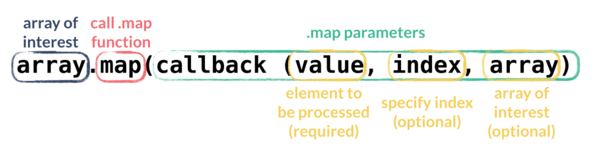
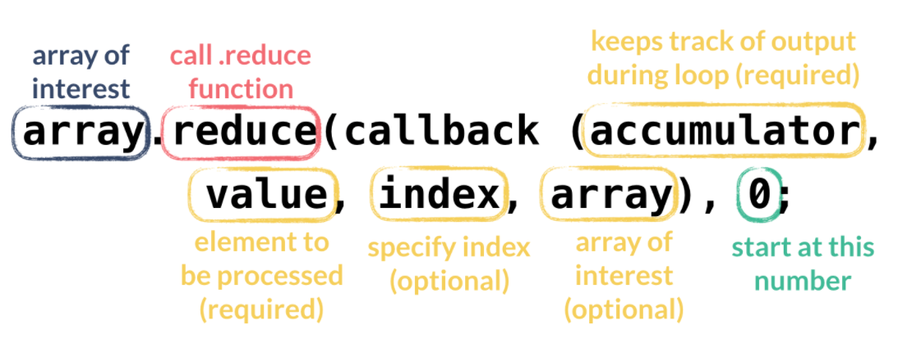

<div class="row">
<div class="columnStmt" markdown="1">

<p align="center" ><a href="https://bloomtech-1.wistia.com/medias/shexdelnr4" >
</a></p> 

##  The useage .map .reduce .filter  

[Home - JavaScript Fundamentals](../README.md) 

[Previous](./Object_1.md) | [Next](./Project.md)

In this lesson, we're going to get a lot of practice playing around with data and transforming it with more loop-like functions. Data transformation, after all, is one of the main goals in our jobs as web engineers since we ultimately display data in some way that makes sense to the end user.

Functional programming is a very fun programming paradigm because it lends itself to this idea of `immutability`. Which is basically creating objects (variables, functions, etc) that can't be changed by other code later on in a codebase. When we get to Redux, you'll learn all about immutability, and you'll have a better grasp of what that concept means by going through some of these exercises today.

First, let's talk about what functions we have at our disposal to make variables and functions immutable. The `.map` `.filter` and `.reduce` functions are commonly used to achieve immutability and take a set of data and transform it in some way.

Let's consider the following data set, an array of object literals. You will often see this data type stored in imported `.JSON` files, including in guided practice today. Here though, our data is written inline, which is also fine.

```
const data = [
  {"city":"seattle", "state":"WA", "population":652405, "land_area":83.9},
  {"city":"new york", "state":"NY", "population":8405837, "land_area":302.6},
  {"city":"boston", "state":"MA", "population":645966, "land_area":48.3},
  {"city":"kansas city", "state":"MO", "population":467007, "land_area":315}
];
```
Let's say we want to represent this data in some way that is useful to our users.

### .map()

`.map` asks us to create an array with just city and state names. We could do this by copying just city and state data into a new array in a `for` loop like so.

```
const cityStates = [];
for(let i = 0; i < data.length; i++) {
  let mappedObj = {};
  mappedObj.city = data[i].city;
  mappedObj.state = data[i].state;
  cityStates.push(mappedObj);
  mappedObj = {};
}
```

That works! It's a simple solution, and simplicity is the gold standard for programming. That said, it's a bit hard to read, so is there a better way? absolutely!

`.map` is a higher-level function that takes 2 arguments, a callback and a context. The callback is a function to be called "for" each item in the array, the context is the object value(s) to be used. You'll often people say they are going to "map" some data. That means they are going to apply a set of rules to a data set. For example "mapping" the array `[1,2,3]` times two would result in `[2,4,6]`.

<p align="center" ></p> 

The map function can also take in a callback that passes back a couple of things to us. The three things you'd get back from a callback passed to Map would be:

- The current item of the array `state`
- The current index of the current item `index`
- The entire array `data`

In the example below, the value given in the callback is `state` since task 1 asks us to look at state data.

```
const mappedCityStates = data.map((state) => {
  return {'city': state.city, 'state': state.state};
});
```

### .filter()

What if we only want to see states who's `population is greater than` 650,000? With your prior JavaScript knowledge it might make sense to create something like this:

```
const largeStates = [];
for(let i = 0; i < data.length; i++) {
  if(data[i].population >= 650000) {
    largeStates.push(data[i]);
  }
}
```

Now, we can use `.filter` to iterate over all items in the array and return only what we want. This is useful anytime we need a subset of a larger group of data.

Filter takes exactly the same arguments as .map, namely: value, index, and array.

```
const filterLargeStates = data.filter((state) => {
  return state.population >= 650000;
});
```
Same results and cleaner code. The line `return state.population >= 650000`; tells JavaScript to return an object whose population is higher than 650,000, and in turn, pass that object to a new array. The other objects (states with a population lower than 650,000) will be ignored since they don't pass this logic test. Think of that line reading like this: `IF state.population is greater than or equal to 650000 THEN push it into a new array ELSE do nothing`.

### .reduce()

Reduce is slightly tricker than `.map` and `.filter` because it requires use of different arguments. Its powers though, are endless. Essentially, reduce works to algorithmically simplify an array down to a single value.

Let's say we want a single number of all of the state's populations added together. With the most basic JavaScript we might do something like this.

```
let statePopulations = 0;
for(let i = 0; i < data.length; i++) {
  statePopulations += data[i].population;
}
```

This is a relatively simple algorithm, but let's look at it in terms of the reduce function now. `.reduce` allows us to reduce all data to a single value. It is a perfect use here because we can aggregate that data and use `.reduce` to do so for us.

```
const reduceStatePopulations = data.reduce((total, state) => {
  return total + state.population;
}, 0);
```

This is more succinct, but a lot is going on here. Importantly, we pass `0` as a second argument to our reduce function. This argument will become the starting value of our `total` and, if not provided, would default to the first item in the array. In this case, that would be disastrous because the first item of our array is an object, and we're trying to reduce our total to a single numerical value. Instead, we can provide a starting value for `total` and thus set what our data type will reduce to. Remember that total also gets `memorized` or remembered by our function each pass.

<p align="center" ></p>

Note, the function will run without the `0` pictured above, but will default to starting accumulation at the first number in the array, which often doesn't make sense

The four items that get passed back from our callback function when using `.reduce` are:

- The current value of the total aggregated value.
- We set the initial value at the end of the function. In this case, we set it to 0.
  - This could be any value, though.
- The current item in the array.
- The index again.
- The full array.
  
To sum up. These functions are fantastic and allow us to write clean, reusable code in a functional programming style. They give us the power to represent our data in an enjoyable way. As you get more and more used to using these functions, you'll get the ability to use them in very complex situations that will eventually save your bacon. For now, let's go practice. Check out the challenge on JSBin. Go play around and see if you can create some new data sets out of the provided data.

## Follow Along

Let's take our same Data Set from earlier and play around with it some more.

```
const data = [
  {"city":"seattle", "state":"WA", "population":652405, "land_area":83.9},
  {"city":"new york", "state":"NY", "population":8405837, "land_area":302.6},
  {"city":"boston", "state":"MA", "population":645966, "land_area":48.3},
  {"city":"kansas city", "state":"MO", "population":467007, "land_area":315}
];
```

1.  Use `.map` to create an array of integers that represent all the states names and populations.
   
The callback function here is what's enclosed in the `return` function. `state` is the value, or element(s) that will be processed.

```
const mappedCityStates = data.map((state) => {
  return {'state': state.state, 'population': state.population};
});
```

2.  Use `.filter` to create an array of states who's land_area is larger than 50 units. Just like with map, we use arrow function syntax to dictate a `return`. Similarly, `state` is the value, or element(s) that will be processed.

```
const filterLandArea = data.filter((state) => {
  return state.land_area >= 50;
});
```

3.  Use `.reduce` to create an array of the states land_area reduced to the `mean average` of all the state's combined.This example uses similar parameters, only adds the counter `total` to accumulate the sum.

```
const landAreaAverage = data.reduce((total, state) => {
  let sum = total + state.land_area;
  console.log(sum, total, state);
  return sum;
}, 0);
const average = landAreaAverage / data.length;
```

## Challenge

Complete the following exercises using `.map`, `.filter`, `.reduce`.


- [Code found here](https://jsbin.com/wolayeb/edit?js,console)


</div>
</div>